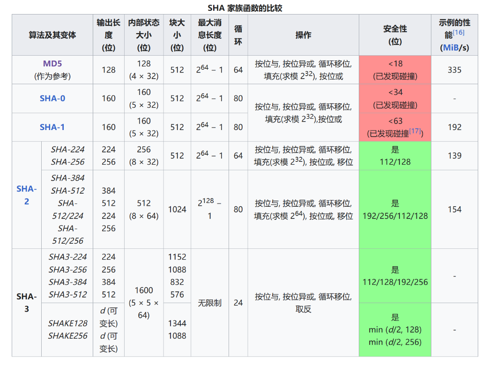

## 分组加密

| 加密算法            | 密钥长度        | 明文分组长度 | 轮数       | 子密钥数量    | 结构      | S-Box   |
| --------------- | ----------- | ------ | -------- | -------- | ------- | ------- |
| DES             | 56          | 64     | 16       | 16       | Feistel | 8×6→8×4 |
| AES Rijndael | 128/192/256 | 128    | 10/12/14 | 44/52/60 | SPN     | 16×8bit |
| IDEA            | 128         | 64     | 8        | 52=8×6+4 |         | Null    |
| SM4             | 128         | 128    | 32       | 32       | Feistel | 4×8bit  |
| SM1             | 128         | 128    |          |          |         |         |
| SM7             | 128         | 128    |          |          |         |         |

- SM4对标AES
- 在IPSec VPN协议中，SM4分组密码算法的属性值是129
- PGP基于IDEA
- GM/T 0006《密码应用标识规范》定义的标识中，不包括`CTR`工作模式
- `CFB`和`CBC`工作模式IV要求每个消息必须唯一，不能重用，且不可预测.

## 流密码

| 算法  | 密钥长度    | IV长度 | 对标  |
| --- | ------- | ---- | --- |
| RC4 | 40–2048 |      |     |
| ZUC | 128     | 128  | RC4 |

- 流密码是美国电报电话公司G. W. Vernam在1917年发明的.
- ZUC算法结构的核心部分包括:
	- LFSR
	- 比特重组BR
	- 非线性函数F

- ZUC算法非线性函数F部分两个线性变换L1和L2具有性质.
	- 均为置换
	- 差分分支数均为5
	- 线性分支数均为5
- 以ZUC算法为核心，成为3GPP LTE标准的算法为
	- 128EEA-3
	- 128EIA-3

- Geffe发生器使用LFSR个数为`3`
## Hash函数

一般Hash函数

| 杂凑 算法       | 输入 限制 | 输出 长度        | 内部 长度 | 分组 长度              | 字 长度 | 结构     | 轮数 |
| -------------- | -------- | --------------- | -------- | --------------------- | ------- | ------ | -- |
| MD5            | 64       | 128             | 128      | 512                   |         | MD     |    |
| SHA-1          | 64       | 160             | 160      | 512                   | 32      | MD     |    |
| SHA-2 (256) | 64       | 224/256         | 256      | 512                   | 32      | MD     |    |
| SHA-2 (512) | 128      | 384/512/224/256 | 512      | 1024                  | 64      | MD     |    |
| SM3            | 无        | 256             |          | 512                   |         | MD     | 64 |
| SHA-3          | 无        | 224/256/384/512 | 1600     | 1152/1088 /832/576 | 64      | Sponge |    |

- SM3消息填充方式与SHA-256相同.
- SHA-2根据内部长度的不同可分为两大类, 一类内部长度为256bit, 另一类内部长度为512bit.
- GB/T 15852《信息技术 安全技术 消息鉴别码》标准中定义的消息鉴别码可以基于如下机制实现:
	- 分组密码
	- 泛杂凑函数
	- 专用杂凑函数

SM3密码杂凑算法的运算中哪些起到混淆的作用？

- [ ]  A.循环移位
- [ ]  B.P置换
- [ ]  C.模加
- [ ]  D.布尔函数

带密钥的Hash:
- Whirlpool

## 公钥

**公钥加密算法**
-  A. Pohlig-Hellman
-  B. Pollard
-  C. ECDSA
-  D. DSS

| 算法名            | 最短安全密钥长度 | 私钥              |     | 原理    | 同态性质 |
| -------------- | -------- | --------------- | --- | ----- | ---- |
| ECC            | 160/224  | /256/           |     | ECC   |      |
| DSS            |          | 160/256/384/512 |     |       |      |
| DSA            |          | 1024/2048/3072  |     |       |      |
| Pollard        |          |                 |     |       |      |
| Pohlig-Hellman |          |                 |     |       |      |
| RSA            | 1024     | 2048/3072/4096  |     | RSA   |      |
| Rabin          |          | 4096            |     | 二次剩余  |      |
| Elgama         | 1024     | 2048/3072       |     | 离散对数  |      |
| SM2            | 256      | 256             |     | ECC   |      |
| SM9            | 256      | 256             |     | ECC   |      |
| ECDSA          |          | 192/256/384/521 |     | ECC   |      |
| ECDH           |          | 192/256/384/521 |     | ECC   |      |
| Paillier       |          |                 |     | 复合剩余类 | 加法同态 |

- 用SM2算法实现一个对1024比特明文的加密，需要1次点乘运算。
- 如果SM2的密文长度是2048比特，那么相应明文长度是1280比特
- SM2推荐使用256bit以上密钥长度
- GM/T 0010《SM2密码算法加密签名消息语法规范》中私钥表达是`SEQUENCE`
- SM2公钥加密算法的密文包含元素:
	- 椭圆曲线点乘
	- 杂凑值
	- 比特串

**公钥签名算法**

| 算法名    | 私钥长度 | 签名长度   | 原理   |
| ------ | ---- | ------ | ---- |
| ECC    |      |        | ECC  |
| RSA    |      |        | RSA  |
| Rabin  |      |        | 大整数  |
| Elgama |      |        | 离散对数 |
| SM2    | 曲线位数 | 两倍曲线位数 | ECC  |
| SM9    |      |        | ECC  |
| ECDSA  | 曲线位数 | 两倍曲线位数 | ECC  |
| ECDH   | 曲线位数 | 两倍曲线位数 | ECC  |

- 基域选择Fp-256时，SM2算法的数字签名的长度为 512 比特。

- 我国SM2公钥密码算法包含3个算法 :
	- 数字签名算法
	- 密钥交换协议
	- 公钥加密解密算法

## 协议

- 认证协议是具有认证功能的一类密码协议，可用干实现身份认证和消息源确认两大目标。从参与者的角度来看，认证协议可分为（ABD）
	- [ ]  A. 单向认证
	- [ ]  B. 双向认证
	- [ ]  C. 多向认证
	- [ ]  D. 混合认证

## 其他

- GM/T 0009《SM2密码算法使用规范》中,用户ID的默认值的长度为`16`个字节。
- GM/T 0035《射频识别系统密码应用技术要求》，分散因子长度不小于`4`字节
- GM/T 0035《射频识别系统密码应用技术要求》第5部分，标签密钥不可以被读出
- GM/T 0035《射频识别系统密码应用技术要求》第3部分，电子标签对读写器的身份鉴别出现在`1`级以上。
2. 密码系统基本部分组成: 明文空间、密文空间、密钥空间、加密算法和解密算法
3. 1990年，德国柏林大学教授普朗克首先提出了“量子论”
