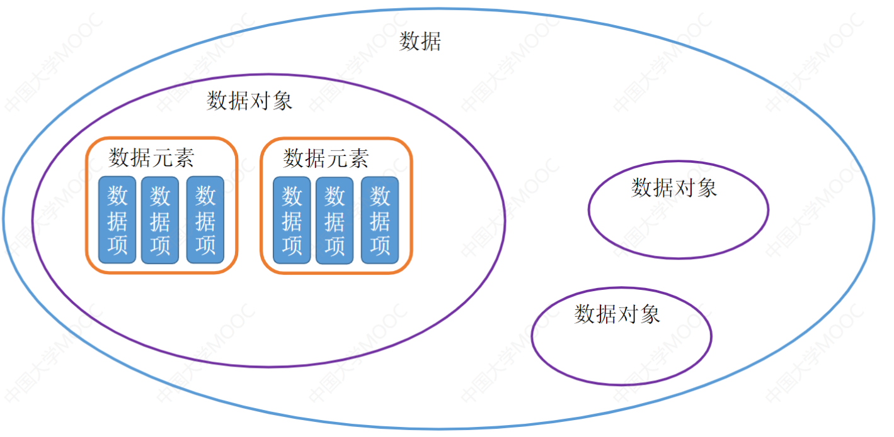

---
tags:
  - 数据结构
  - cpp
---
---
## 数据结构基本概念

### 基础

- 数据
    数据是信息的载体，是描述客观事物属性的数、字符及所有能输入到计算机中并被计算机程序识别和处理的符号的集合

- 数据元素 & 数据项
    数据元素是数据的基本单位，通常作为一个整体进行考虑和处理。一个数据元素可由若干数据项组成，数据项是构成数据元素的不可分割的最小单位.

- 数据结构 & 数据对象 
    数据结构是相互之间存在一种或多种特定关系的数据元素的集合。数据对象是具有相同性质的数据元素的集合，是数据的一个子集.

- 抽象数据类型ADT
    ADT 用数学化的语言定义数据的逻辑结构、定义运算.

- 数据类型
    是一个值的集合和定义在此集合上的一组操作的总称。
    - 原子类型。其值不可再分的数据类型。
    - 结构类型。其值可以再分解为若干成分（分量）的数据类型

### 三要素
- 逻辑结构
    - 集合
    - 线性: 一对一
    - 树形: 一对多
    - 图状: 多对多
- 物理结构(存储结构)
    - 顺序存储
    - 非顺序存储
        - 链式存储
        - 索引存储
            在存储元素信息的同时，还建立附加的索引表。索引表中的每项称为索引项，索引项的一般形式是（关键字，地址）
        - 散列存储
            根据元素的关键字直接计算出该元素的存储地址
- 数据运算
    - 运算的定义是针对逻辑结构的，指出运算的功能；
    - 运算的实现是针对存储结构的，指出运算的具体操作步骤;

---
## 算法 基础概念

### 基础
算法（Algorithm）是对特定问题求解步骤的一种描述，它是指令的有限序列，其中的每条指令表示一个或多个操作

- 算法特性
	- 有穷性。
		一个算法必须总在执行有穷步之后结束，且每一步都可在有穷时间内完成。用有限步骤解决某个特定的问题
		注：算法必须是有穷的，而程序可以是无穷的
	- 确定性。
		算法中每条指令必须有确切的含义，对于相同的输入只能得出相同的输出.
	- 可行性。
		算法中描述的操作都可以通过已经实现的基本运算执行有限次来实现.
	- 输入
	- 输出

- 好算法特质
	- 正确性
	- 健壮性
	- 可读性
	- 高效率与低存储

### 时间复杂度 T(n)
事前预估算法时间开销T(n)与问题规模 n 的关系.

![[Pasted image 20240505154933.png]]

### 空间复杂度 S(n)

**递归程序空间占用**

---

---
