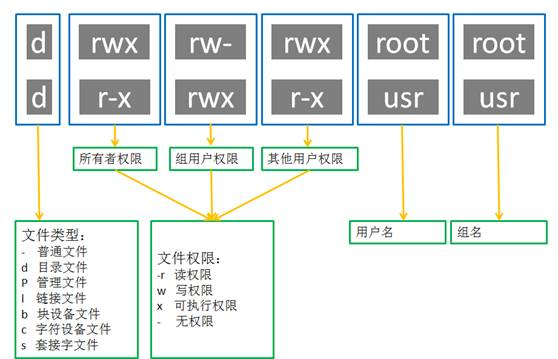
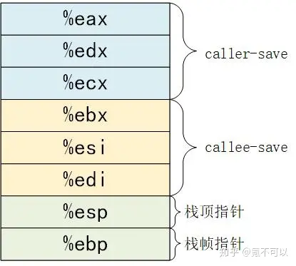
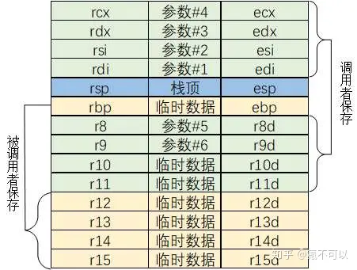
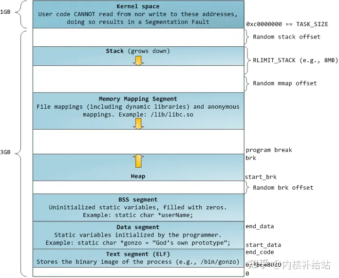
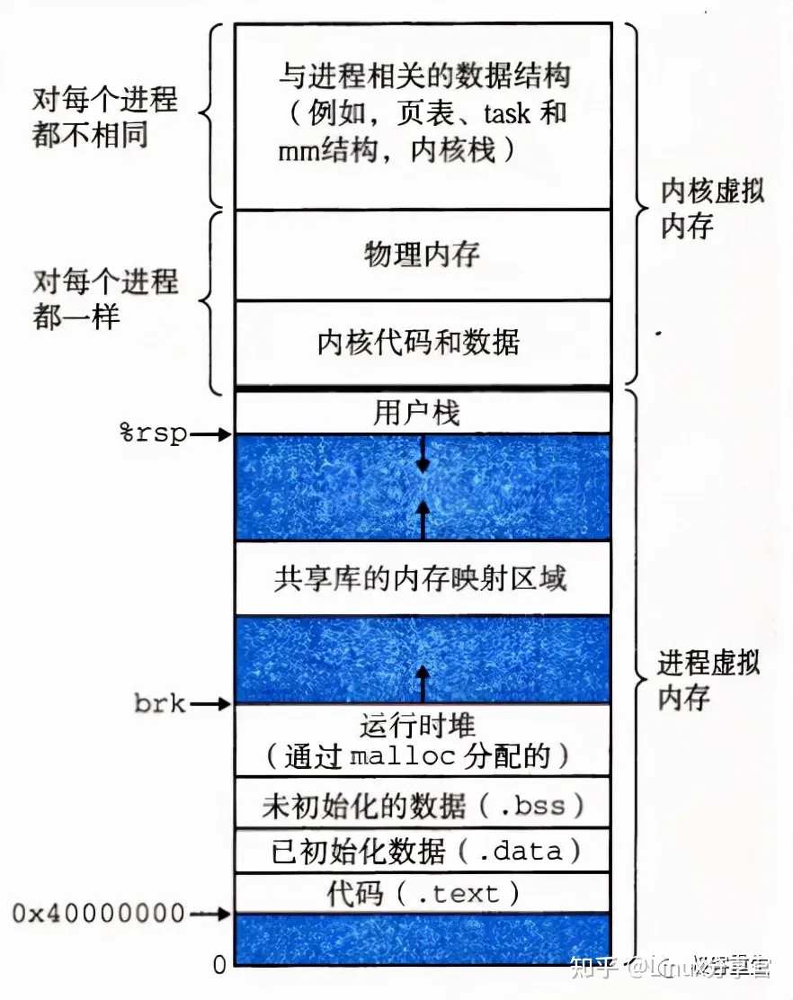

# 软件安全

## 1. linux基础知识

## 1.1 权限管理

### **rwx权限**

基于UGO模型进行控制, u:代表user(用户), g:代表group(组), o:代表other(其他).



### **特殊权限**

suid,sgid,sticky

1. suid:是针对二进制可执行程序上的，对目录设置无效. 
   作用：让普通用户可以以root(或其他)的用户角色运行只有root才能运行的程序或命令. 
   在文件所有者权限的第三位为小写的s，就代表拥有suid属性.
   
   大写的 `S` 发生于当设置了 `setuid` 或 `setgid` 位、但没有设置可执行位 `x` 时。

2. sgid:既可以针对文件也可以针对目录设置. 
   
   程序**以拥有该文件的组运行**.
   
   作用：在设置了sgid权限的目录下建立文件时，新创建的文件的所属组会继承上级目录的所属组. 
   在文件所属组权限的第三位为小写的`s`，就代表拥有sgid属性.

3. sticky:设置sticky可以将自己的文件保护起来. 
   在其他用户权限位的第三位为小写t.
   
   ```C
   drwxrwxrwt  33 root root  1000  1月10日 15:15 tmp
   ```
   
   *粘滞位权限只能针对⽬录设置，对于⽂件⽆效*
   
   **当一个目录被设置为"粘滞位"(用chmod +t),则该目录下的文件只能由  
   一、超级管理员删除  
   二、该目录的所有者删除  
   三、该文件的所有者删除**

### **运行权限**

uid euid setuid() seteuid()

linux 下有 4 种 uid 如下

- real user id. 表示进程的实际执行者, 只有 root 才能更改 real uid.

- effective user id. 用于检测进程在执行时所获得的访问文件的权限.

- saved user id. 用于保存 euid, 以便当 euid 设置成其他 id 时再设置为原值.

- File System UID. 只用于对文件系统的访问权限控制.

相应的,linux 会提供系统调用以修改进程的 uid.

1. setuid(uid).
   首先请求内核将本进程的 real uid,euid 和 saved uid 都设置成函数指定的 uid, 若权限不够则只修改 euid, 仍不行则调用失败.

2. seteuid(uid).
   
   仅请求内核将本进程的 euid 设置成函数指定的 uid.

### **目录权限与文件权限**

- 读（**r**/4）：对文件而言，具有读取文件内容的权限；对于目录而言，具有浏览该目录信息的权限
- 写（**w**/2）：对文件而言，具有修改文件内容的权限；对于目录而言，具有删除和移动目录内文件的权限
- 执行（**x**/1）：对文件而言，具有执行文件的权限；对于目录而言，具有进入目录的权限

## 1.2 系统目录结构

---

## 2. 硬件架构

**x86**

```c
EAX：一般用作累加器
EBX：一般用作基址寄存器（Base）
ECX：一般用来计数（Count）
EDX：一般用来存放数据（Data）
ESP：一般用作堆栈指针（Stack Pointer）
EBP：一般用作基址指针（Base Pointer）
ESI：一般用作源变址（Source Index）
EDI：一般用作目标变址（Destinatin Index）
```



**x64**



1）6个寄存器用来保存参数，多出的参数类似x86入栈；  
2）若存在闲置的寄存器的话，局部变量可以直接缓存到闲置寄存器中，过多局部变量类似x86入栈；  
3）因为是64位，rsp栈指针每次移动8个字节：类似 movq -8(%rsp),%rsp  
4）函数可以访问％rsp之后最多128个字节的内存：“红色区域”，意味着可以在通过%rsp的来在“红色区域”内存储一些临时数据。而不必使用使用多条指令。参考栈帧章节。  
5）在编译优化时，栈帧指针rbp被弃用，成为通用一般寄存器。所有对当前栈帧中的内存字段的访问引用,由%rsp进行相对寻址来实现。参考栈帧章节。

## 3. 内存结构

### 内核与用户空间

一旦虚拟地址投入使用,它就用于此计算机中所有运行的软件，也包括内核本身。所以，虚拟地址空间的一部分必须保留给内核。

这并不意味内核需要使用如此多的物理内存，而是因为内核可以使用这部分地址空间去映射到任何他想要的物理内存。内核空间在页表中被标记为只有特权代码（ring2或者更低。在此说明一下**特权等级**的概念：Intel x86架构CPU共有四个特权等级，0~3。0级最高，3级最低。硬件在执行每条指令时会检查其特权等级。对于Linux/Unix，只是使用了0级和3级，即Ring0 和 Ring3。在Linux中来看，0级也就表示内核态，3表示用户态)。当用户态程序想染指内核空间时会引发页面异常。在Linux系统中，内核空间总是映射到相同的物理地址空间。

内核代码和数据总是可寻址的，为的是随时准备响应中断或者系统调用。相比之下，进程地址空间的用户态部分随着进程切换而变化。




--- 

## 内存地址对齐

### 1. 结构体大小对齐

在没有#pragma pack 宏的声明下，遵循下面三个原则：

1、第一个成员的首地址为0.

2、每个成员的首地址是自身大小的整数倍.

3、结构体的总大小，为其成员中所含最大类型的整数倍.

### 2. 变量首地址对齐

存放数据的首地址是某个数（4，8或32）的倍数。

### 3. malloc申请对齐

32bit OS malloc最小长度16Byte.

32bit OS malloc首地址8Byte对齐

---

## 实验总结

### 环境变量

使用fork()创建新进程, 子进程会继承父进程的环境变量.

不同用户之间的环境变量是隔离的,一个程序执行时会使用对应拥有者的环境变量.

system()函数调用直接使用程序的环境变量作为新进程的环境变量.而execev()不直接复制程序的环境变量,而是使用函数参数作为新进程环境变量.
若传入NULL值则代表环境变量设为空,若传入全局变量environ则表示将原进程的环境变量传入新进程.

 dash的安全机制保证Set-uid程序在运行dash时自动降权,能有效防止Set-uid程序的越权操作.

 system()调用实质上使用shell运行输入指令,因此可通过精心构造参数运行多条命令,存在一定的安全性问题.
而execve()调用最多只能运行单条命令,不存在上述问题.

 Set-UID root程序即使使用setuid()降低权限,也仍有可能发生权限泄露问题.该进程可能在它仍然享有特权时已经获得了一些特
权功能.当特权降级时,如果程序没有清理这些功能，则它们仍然可以由非特权进程访问.

### 随机数

C语言中的rand函数可用来伪随机数,但生成的伪随机数序列可被随机数种子唯一确定.因此伪随机数种子的取值至关重要.若攻击者无法预测伪随机数种子,则生成的伪随机数也无法预测.
在本次实验中,受害者Alice直接使用当前时间作为随机数种子生成随机数,并将其作为密钥加密重要文件,却忽视了该随机数种子易被猜测的缺陷.从而导致攻击者易推导出加密密钥,进而获取Alice的机密文件.

仅靠软件获得随机性是困难的,Linux从鼠标、键盘、中断和块设备请求完成时间这四个物理资源中获得随机性,并将从物理资源收集的随机数据存储到一个随机池中，然后使用两个设备将随机源转换为伪随机数.

/dev/random 设备是阻塞设备,每当该设备给出随机数时随机池的熵将减小,当熵达到零时/dev/random 将阻塞.
/dev/urandom 将随机池中的数据视作随机数种子,会无限生成新的数.

理论上讲，/dev/random 设备更加安全，但是实践上并没有很大的差异.
在Task5中,/dev/urandom生成的伪随机数质量同样很高, 几乎已经到达随机性的极限.
但/dev/random 的阻塞行为可能导致拒绝服务攻击,因此我们一般使用/dev/urandom即可.
